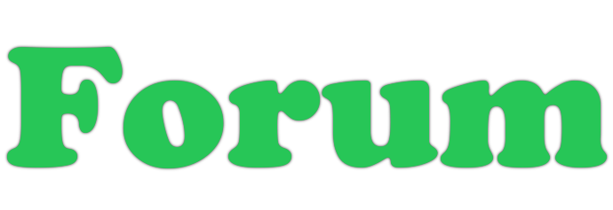

<p align="center">
    <a href="https://github.com/hamzahamidi/angular-forum/actions?query=workflow%3ABuild">
        
    </a>
    <a href="https://github.com/hamzahamidi/angular-forum/releases/latest">
        
    </a>
    <a href="https://app.netlify.com/sites/demo-forum/deploys">
        
    </a>
    <a href="https://github.com/hamzahamidi/angular-forum/blob/main/LICENSE">
        
    </a>
</p>

> ### Angular project containing real world examples (CRUD, auth, advanced patterns, etc).

# 


### [Demo](http://hamidihamza.com/angular-forum)&nbsp;&nbsp;&nbsp;&nbsp;

This codebase was created to demonstrate a fully fledged application built with Angular that interacts with an actual backend server including CRUD operations, authentication, routing, pagination, and more.


# Getting started

Make sure you have the [Angular CLI](https://github.com/angular/angular-cli#installation) installed globally. 

We use npm the default package manager of NodeJs & install the dependencies with `npm install`.

Run `ng serve` for a dev server. Navigate to `http://localhost:4200/`. The app will automatically reload if you change any of the source files.

## Building the project
Run `npm run build` to build the project. The build artifacts will be stored in the `dist/` directory.

## Docker

Or simply run the example using docker:

```bash
docker-compose up
```
Then navigate to `http://localhost:4200/

## Functionality overview

The example application is a social blogging site (i.e. a Medium.com clone).

**General functionality:**

- Authenticate users via JWT (login/signup pages + logout button on settings page)
- CRU* users (sign up & settings page - no deleting required)
- CRUD Articles
- CR*D Comments on articles (no updating required)
- GET and display paginated lists of articles
- Favorite articles
- Follow other users

**The general page breakdown looks like this:**

- Home page (URL: /#/ )
    - List of tags
    - List of articles pulled from either Feed, Global, or by Tag
    - Pagination for list of articles
- Sign in/Sign up pages (URL: /#/login, /#/register )
    - Uses JWT (store the token in localStorage)
    - Authentication can be easily switched to session/cookie based
- Settings page (URL: /#/settings )
- Editor page to create/edit articles (URL: /#/editor, /#/editor/article-slug-here )
- Article page (URL: /#/article/article-slug-here )
    - Delete article button (only shown to article's author)
    - Render markdown from server client side
    - Comments section at bottom of page
    - Delete comment button (only shown to comment's author)
- Profile page (URL: /#/profile/:username, /#/profile/:username/favorites )
    - Show basic user info
    - List of articles populated from author's created articles or author's favorited articles
